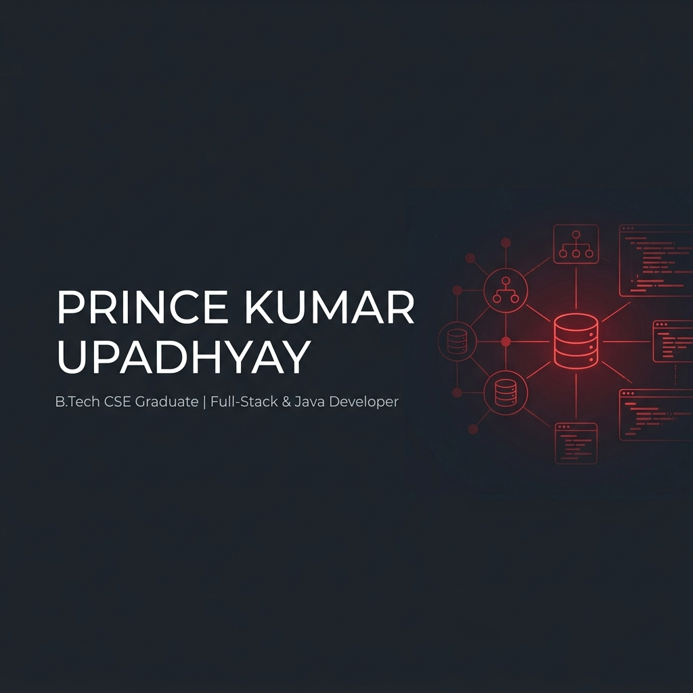

  

# Hi, I'm Prince Kumar Upadhyay 👋
### B.Tech Computer Science & Engineering Graduate (2026)

  
  

---

## About Me

I am a **B.Tech Computer Science & Engineering Graduate (Class of 2026)** from **Swami Vivekanand Subharti University (SVSU), Meerut, India**. I have a strong foundation in **Java Programming, Data Structures & Algorithms (DSA), Object-Oriented Programming (OOP), Database Management Systems (DBMS)**, and modern **Full-Stack Web Development** using the **MERN Stack**. I enjoy building responsive, scalable, and user-centric web applications while continuously enhancing my software engineering skills.

*  **Current Focus:** Full-Stack Web Development, Java Development, and Problem Solving.
*  **Technical Skills:** Java, DSA, OOP, HTML5, CSS3, JavaScript, React.js, MongoDB, MySQL, SQL, DBMS, Git, and GitHub.
*  **Career Objective:** Seeking opportunities as an **Associate Software Engineer, Software Engineer, Full-Stack Developer, Java Developer, or Backend Developer**, where I can contribute to building scalable software solutions while continuously learning and growing as a software engineering professional.

---

##  Tech Stack & Skills

| **Domain**                | **Technologies**                                                                                                                                     |
| :------------------------ | :--------------------------------------------------------------------------------------------------------------------------------------------------- |
| **Programming Languages** | Java, JavaScript, SQL                                                                                                                                |
| **Frontend Development**  | HTML5, CSS3, React.js, Responsive Web Design                                                                                                         |
| **Databases**             | MongoDB (Mongoose), MySQL                                                                                                                            |
| **Core Computer Science** | Data Structures & Algorithms (DSA), Object-Oriented Programming (OOP), Database Management Systems (DBMS), Operating Systems (OS), Computer Networks |
| **Tools & Platforms**     | Git, GitHub, Visual Studio Code                                                                                                                      |
| **Areas of Interest**     | Software Engineering, Full-Stack Development, Java Development, Web Technologies                                                                     |

---

##  Featured Project

###  [Trillioty Prime (News & Discussion Platform)](https://github.com/PrinceUpadhyay309/trillioty-prime)
*A full-stack digital news agency, magazine portal, and community forum board.*

* **Architecture:** Structured MVC MERN pattern featuring responsive layouts, an active breaking news ticker, and read-depth tracking.
* **Backend:** Clean JWT cookie-based session management with role-based access control (Admin, Editor, Author, Reader).
* **Community Engine:** "Charcha" threaded discussion forums supporting nested replies, upvote/downvote models, and karma-based reputation systems.
* **Tech Stack:** MongoDB, Express.js, React.js, Node.js, Mongoose, TailwindCSS.

---

##  Github Metrics

  
  

  

